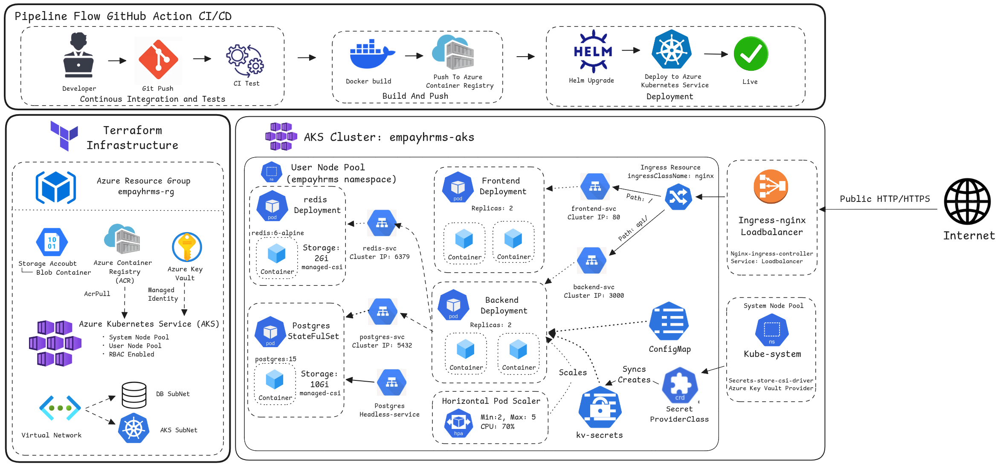

# EmPay HRMS

> A production-grade, cloud-native **Human Resource & Payroll Management System** deployed on **Azure Kubernetes Service** with a fully automated **GitHub Actions CI/CD pipeline** and **Terraform-managed infrastructure**.

---

## 🏗️ DevOps Architecture



---

## 📦 Technology Stack

### Application
| Layer | Technology |
|---|---|
| Frontend | React + Vite (served via NGINX) |
| Backend | Node.js + Express (Bun runtime) |
| Database | PostgreSQL 15 (StatefulSet) |
| Cache | Redis 6 Alpine |
| API Docs | OpenAPI / Swagger UI |
| Package Manager | Bun |

### DevOps & Infrastructure
| Category | Technology |
|---|---|
| Cloud Provider | Microsoft Azure |
| Infrastructure as Code | Terraform |
| Container Orchestration | Azure Kubernetes Service (AKS) |
| CI/CD | GitHub Actions (3 chained workflows) |
| Container Registry | Azure Container Registry (ACR) |
| Secret Management | Azure Key Vault + CSI Driver |
| Kubernetes Packaging | Helm |
| Ingress Controller | NGINX Ingress (LoadBalancer) |
| Autoscaling | Horizontal Pod Autoscaler (HPA) |
| Storage | Azure Disk (managed-csi) |

---

## 🔄 CI/CD Pipeline — GitHub Actions

The pipeline is split into **3 chained workflows** that trigger sequentially on a push to `main`:

```
Developer → Git Push → [CI] → [BUILD & PUSH] → [DEPLOY] → Live ✅
```

### Workflow 1 — `CI` (`ci.yaml`)
Triggered on: `push` to `main` / `develop`, or `pull_request` to `main`
- Runs **backend** lint + tests (`bun test`)
- Runs **frontend** lint + tests (`bun test`)

### Workflow 2 — `BUILD_AND_PUSH` (`build-push.yaml`)
Triggered on: `CI` workflow success
- Builds **backend** Docker image from `./backend/Dockerfile`
- Builds **frontend** Docker image from `./nginx/Dockerfile`
- Tags images with **both `latest` and commit SHA** for traceability
- Pushes both images to **Azure Container Registry (ACR)**

### Workflow 3 — `DEPLOY` (`deploy.yaml`)
Triggered on: `BUILD_AND_PUSH` workflow success
- Logs in to Azure and fetches AKS credentials
- Runs `helm upgrade --install` with `--atomic` flag (auto-rollback on failure)
- Passes image tags pinned to the **commit SHA** (`--set *.image.tag=$SHA`)
- Verifies both frontend and backend rollouts via `kubectl rollout status`
- Cleans up secrets from the runner after deploy

---

## ☁️ Terraform Infrastructure

All Azure infrastructure is defined as code under `terraform/` using modular structure.

```
terraform/
├── main.tf               # Root module — wires everything together
├── variables.tf
├── outputs.tf
├── backend.tf            # Remote state (Azure Storage)
└── modules/
    ├── network/          # VNet, AKS Subnet, DB Subnet, NSGs
    ├── aks/              # AKS Cluster, System + User node pools
    ├── acr/              # Azure Container Registry + AcrPull role
    └── keyvault/         # Key Vault + secrets (JWT, DB, Redis passwords)
```

### Resources Provisioned

| Resource | Details |
|---|---|
| Resource Group | `empayhrms-rg` |
| Virtual Network | AKS Subnet + DB Subnet with NSGs |
| AKS Cluster | `empayhrms-aks` — System Pool + User Pool, RBAC, OIDC |
| Azure Container Registry | `empayhrmsacr` — AcrPull role assigned to AKS kubelet identity |
| Azure Key Vault | `empayhrms-kv-*` — stores JWT secret, DB password, Redis password |
| Log Analytics Workspace | OMS agent connected to AKS for monitoring |

### AKS Node Pools

| Pool | Purpose | Notes |
|---|---|---|
| `system` (default) | Kubernetes system components | `only_critical_addons_enabled = true` |
| `user` | All application workloads | Auto-scaling enabled via VMSS |

---

## ☸️ Kubernetes — Helm Chart

All Kubernetes resources are packaged as a **Helm chart** under `helm/empayhrms/`.

```
helm/empayhrms/
├── Chart.yaml
├── values.yaml             # All default configuration
├── values.secrets.yaml     # Non-KV secrets (GROQ, SMTP) — not committed
└── templates/
    ├── namespace.yaml
    ├── configmap.yaml
    ├── secretproviderclass.yaml   # Syncs secrets from Azure Key Vault
    ├── secret-external.yaml       # App secrets (GROQ, SMTP)
    ├── frontend/
    │   ├── deployment.yaml
    │   └── service.yaml
    ├── backend/
    │   ├── deployment.yaml
    │   ├── backend-svc.yaml
    │   └── hpa.yaml
    ├── postgres/
    │   ├── statefulset.yaml
    │   ├── service.yaml           # ClusterIP + Headless service
    │   └── pvc.yaml
    ├── redis/
    │   ├── deployement.yaml
    │   ├── service.yaml
    │   └── pvc.yaml
    └── ingress/
        └── ingress.yaml
```

### Deployed Components

#### Frontend Deployment
- **Image:** `empayhrmsacr.azurecr.io/frontend` (NGINX-served React app)
- **Replicas:** 2
- **Port:** 80
- **Node Pool:** User (`nodeSelector: nodepool: user`)

#### Backend Deployment
- **Image:** `empayhrmsacr.azurecr.io/backend` (Node.js/Express API)
- **Replicas:** 2
- **Port:** 3000
- **Secrets:** Injected from Key Vault (`JWT_SECRET`, `DB_PASSWORD`, `REDIS_PASSWORD`) and app secrets (`GROQ_API_KEY`, `SMTP_USER`, `SMTP_PASS`)
- **Config:** Injected from ConfigMap (`DB_HOST`, `REDIS_HOST`, `NODE_ENV`, etc.)
- **HPA:** Min 2 → Max 5 pods, CPU target: 70%

#### PostgreSQL StatefulSet
- **Image:** `postgres:15`
- **Port:** 5432
- **Storage:** 10Gi (`managed-csi` — Azure Disk)
- **Services:** `postgres-svc` (ClusterIP) + `postgres-headless-svc` (Headless)

#### Redis Deployment
- **Image:** `redis:6-alpine`
- **Port:** 6379
- **Storage:** 2Gi (`managed-csi` — Azure Disk)
- **Service:** `redis-svc` (ClusterIP)

#### Ingress (NGINX)
- `ingressClassName: nginx` — routes all public traffic
- `Path: /` → `frontend-svc:80`
- `Path: /api` → `backend-svc:3000`

#### Secret Management Flow
```
Azure Key Vault
      │
      ▼  (Azure Key Vault CSI Driver)
SecretProviderClass
      │
      ▼  (Syncs & Creates)
Kubernetes Secret (kv-secrets)
      │
      ▼  (Mounted as env vars)
Backend Pod
```

---

## 🚀 Local Development Setup

### Prerequisites
- [Bun](https://bun.sh) >= 1.3.3
- PostgreSQL 14+
- Redis (optional for local dev)

### 1. Clone the Repository

```bash
git clone https://github.com/<your-org>/EmPay_HRMS.git
cd EmPay_HRMS
```

### 2. Configure Backend Environment

Create `backend/.env`:

```env
PORT=3000
NODE_ENV=development

# Database
DB_HOST=localhost
DB_PORT=5432
DB_USER=empay
DB_PASSWORD=your_password
DB_NAME=empayhrms

# Auth
JWT_SECRET=your_jwt_secret

# Redis
REDIS_HOST=localhost
REDIS_PORT=6379
REDIS_PASSWORD=
REDIS_CACHE_ENABLED=false

# Optional — AI Features
GROQ_API_KEY=your_groq_api_key
GROQ_MODEL=llama-3.3-70b-versatile

# Optional — Email
SMTP_USER=your_smtp_user
SMTP_PASS=your_smtp_pass
```

### 3. Configure Frontend Environment

Create `frontend/.env`:

```env
VITE_API_BASE_URL=/api
VITE_APP_NAME=EmPay
```

### 4. Start Backend

```bash
cd backend
bun install
bun run start
```

### 5. Start Frontend

```bash
cd frontend
bun install
bun run dev
```

### API Documentation

Once the backend is running, Swagger UI is available at:

```
http://localhost:3000/api/docs
```

---

## 🛠️ Deploying to AKS (Manual Steps)

### Prerequisites
- Azure CLI (`az`) logged in
- `kubectl` configured for `empayhrms-aks`
- Helm v3.16+
- Terraform applied (`cd terraform && terraform apply`)

### Step 1 — Enable Key Vault CSI Driver on AKS

```bash
az aks enable-addons \
  --resource-group empayhrms-rg \
  --name empayhrms-aks \
  --addons azure-keyvault-secrets-provider

# Verify pods are running
kubectl get pods -n kube-system -l app=secrets-store-csi-driver
```

### Step 2 — Install NGINX Ingress Controller

```bash
helm repo add ingress-nginx https://kubernetes.github.io/ingress-nginx
helm repo update

helm install ingress-nginx ingress-nginx/ingress-nginx \
  --namespace ingress-nginx \
  --create-namespace \
  --set controller.replicaCount=1

# Wait for External IP
kubectl get service ingress-nginx-controller -n ingress-nginx --watch
```

### Step 3 — Prepare Helm Secrets Values

```bash
cp helm/empayhrms/values.secrets.example.yaml helm/empayhrms/values.secrets.yaml
# Fill in your GROQ API key, SMTP credentials
```

### Step 4 — Deploy the Helm Chart

```bash
helm upgrade --install empayhrms ./helm/empayhrms \
  --namespace empayhrms \
  --create-namespace \
  -f ./helm/empayhrms/values.yaml \
  -f ./helm/empayhrms/values.secrets.yaml \
  --atomic \
  --wait \
  --timeout 5m
```

### Verify Deployment

```bash
kubectl get all -n empayhrms
kubectl rollout status deployment/empayhrms-backend -n empayhrms
kubectl rollout status deployment/empayhrms-frontend -n empayhrms
```

---

## 📁 Repository Structure

```
EmPay_HRMS/
├── .github/
│   └── workflows/
│       ├── ci.yaml             # Lint & test
│       ├── build-push.yaml     # Docker build & push to ACR
│       └── deploy.yaml         # Helm deploy to AKS
├── backend/                    # Node.js + Express REST API
├── frontend/                   # React + Vite web app
├── nginx/                      # NGINX config + Frontend Dockerfile
├── helm/
│   └── empayhrms/              # Helm chart for full deployment
├── terraform/                  # Azure infrastructure as code
└── DevOpsArchitecture.png      # Architecture diagram
```
