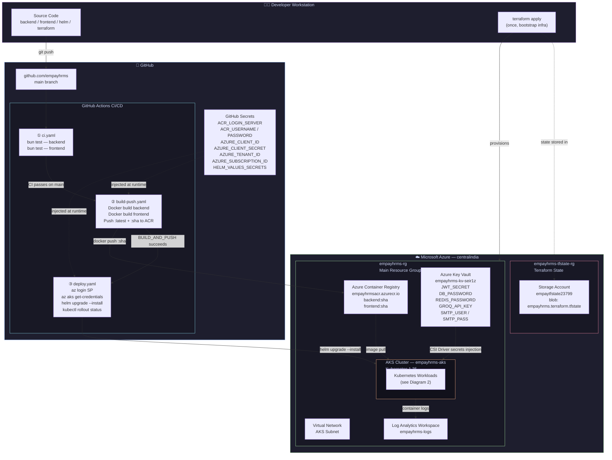
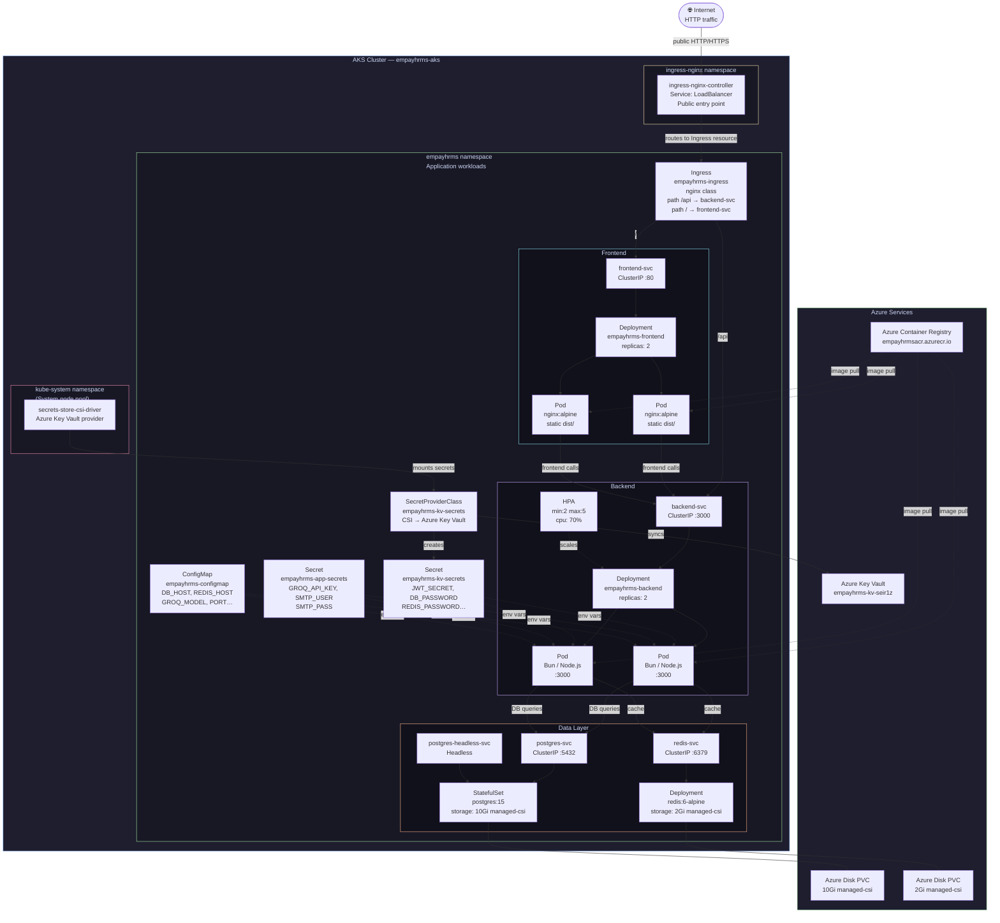

# EmPay HRMS — Architecture Diagrams

## Diagram 1 — Complete DevOps Architecture

---

## Diagram 2 — Kubernetes Cluster Detail

### Production layout used by this chart

- `kube-system` hosts the AKS-managed add-ons, including the CSI driver.
- `ingress-nginx` hosts the public NGINX ingress controller installed by Helm.
- `empayhrms` hosts the application namespace where the backend, frontend, ingress object, database, Redis, ConfigMap, and secrets live.
- Traffic flow is Internet -> ingress controller LoadBalancer -> Ingress resource -> ClusterIP services -> pods.
- The backend and frontend deployments are scheduled to the `user` node pool through `nodeSelector: nodepool: user`.
